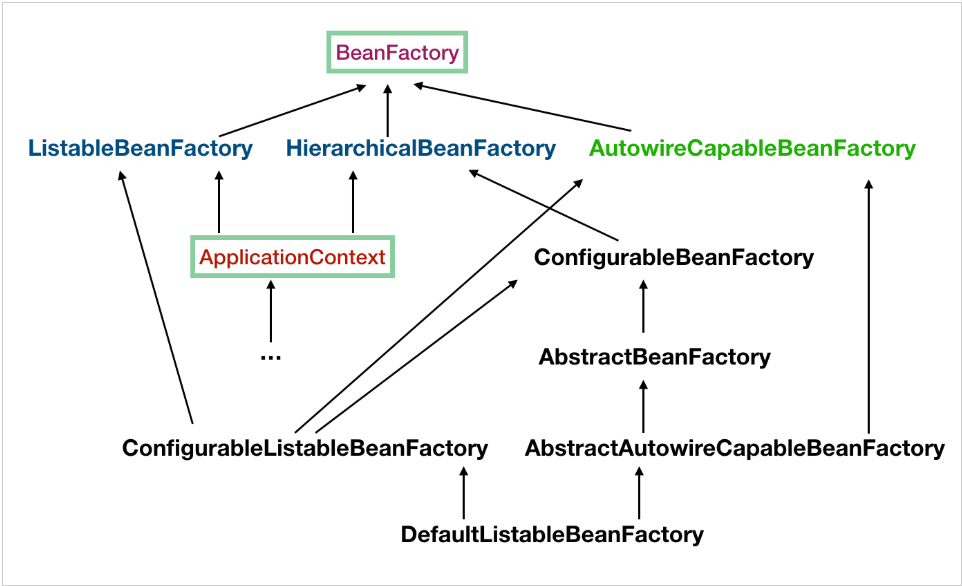

*由简书搬迁而来[**原文链接**](https://www.jianshu.com/p/263a6e3198cd)*

> 目录  
>   1 数据交换格式  
>   2 Java反射  
>   3 Spring简介  
>   4 Spring IOC  
>   5 代理  
>   6 Spring AOP  
>   7 Spring MVC  
>   8 Spring JDBC  
>   9 Spring 事务  
>   10 Spring 远端调用  
>   11 Spring代码  
>
> 参考资料：  
>  
> - 《Spring 技术内幕》  
> - JavaG  
> - JavaD  
> - 简书文章  

# 数据交换格式

  客户端与服务器常用数据交换格式xml、JSON、html。XML是重量级数据格式，传输过程中占带宽较大，传输效率不高；JSON是轻量级的数据格式，占带宽较小。

## 应用场景

- 移动端、互联网项目，大多采用http+JSON，走restful风格。
- webService服务采用http+XML，多用于银行项目。

## JSON

  JSON(JavaScript Object Notation)是一种轻量级的数据交换格式，相比于xml这种数据交换格式来说，因为解析xml比较的复杂，而且需要编写大段的代码，所以客户端和服务器的数据交换格式往往通过JSON来进行交换。
样例:
```json
 {
   "sites": [
         {
           "name": "baidu",
           "url": "www.baidu.com"
         },
         {
           "name": "sougou",
           "url": "www.sougou.com"
         }
         ]
 }
```
### JSON格式说明

  JSON的形式是用大括号“{}”包围起来的项目列表，每一个项目间用逗号（,）分隔，而项目就是用冒号（:）分隔的属性名和属性值。这是典型的字典表示形式，也再次表明javascript里的对象就是字典结构。不管多么复杂的对象，都可以用一句JSON代码来创建并赋值。在JSON中，名称/值对包括字段名称（在双引号中），后面写一个冒号，然后是值。

  json简单说就是javascript中的对象和数组，所以这两种结构就是**对象**和**数组**两种结构，通过这两种结构可以表示各种复杂的结构

（1）对象：对象在js中表示为“{}”括起来的内容，数据结构为 {key：value,key：value,...}的键值对的结构，在面向对象的语言中，key为对象的属性，value为对应的属性值，所以很容易理解，取值方法为 对象.key 获取属性值，这个属性值的类型可以是 数字、字符串、数组、对象几种。

（2）数组：数组在js中是中括号“[]”括起来的内容，数据结构为 ["java","javascript","vb",...]，取值方式和所有语言中一样，使用索引获取，字段值的类型可以是 数字、字符串、数组、对象几种。经过对象、数组2种结构就可以组合成复杂的数据结构了。

### fastjson

​	常用的JSON解析框架有：fastjson(阿里)、gson(谷歌)、jackson(SpringMVC自带)。下面主要介绍阿里的fastjson。

​	另一篇博文介绍了主要用法[fastjson汇总](https://jason-qianhao.github.io/_posts/2021-06-26-fastjson汇总/)

#### maven依赖
```xml
 <dependency>
   <groupId>com.alibaba</groupId>
   <artifactId>fastjson</artifactId>
   <version>1.1.43</version>
 </dependency>
```
#### 解析json
```java
 static String jsonStr = "{\"sites\":[{\"name\":\"baidu\",\"url\":\"www.baidu.com\"},{\"name\":\"sougou\",\"url\":\"www.sougou.com/\"}]}"; public static void main(String[] args) { 
   JSONObject jsonObject = new JSONObject(); // 将json字符串转为jsonbject 
   JSONObject jsonStrObject = **jsonObject.parseObject(jsonStr); // 这里也可以用JSON.parseObject(jsonStr)**
   JSONArray jsonArray = jsonStrObject.getJSONArray("sites"); 
   for (Object object : jsonArray) { 
     JSONObject stObject = (JSONObject) object;
     String name = stObject.getString("name");
     String url = stObject.getString("url");
     System.out.println(name + "---" + url); 
   }
 }
```
#### 组装json
```java
 JSONObject jsonObject = new JSONObject();
 JSONArray jsonArray = new JSONArray();
 JSONObject stObject = new JSONObject();
 stObject.put("name", "baidu");
 stObject.put("url", "http://www.baidu.com");
 jsonArray.add(stObject);
 jsonObject.put("sites", jsonArray);
 System.out.println(**jsonObject.toJSONString()**);**//这里也可以用JSON.toJSONString(root, SerializerFeature.WriteMapNullValue);后面的参数为是否显示null值等控制参数。**
```
## XML

  它是可扩展标记语言（Extensible Markup Language，简称XML），是一种标记语言。主要用于描述数据和用作配置文件。

  XML文档在逻辑上主要由一下 5 个部分组成：

  （1）XML声明：指明所用 XML 的版本、文档的编码、文档的独立性信息

  （2）文档类型声明：指出XML文档所用的 DTD

  （3）元素：由开始标签、元素内容和结束标签构成

  （4）注释：以结束，用于对文档中的内容起一个说明作用

  （5）处理指令：通过处理指令来通知其他应用程序来处理非XML格式的数据，格式为

　　XML文档的根元素被称为文档元素，它和在其外部出现的处理指令、注释等作为文档实体的子节点，根元素本身和其内部的子元素也是一棵树。

> <?xml version="1.0" encoding="UTF-8"?>
>   <students>
>     <student1 id="001">
>       <微信公众号>@残缺的孤独</微信公众号>
>       <学号>20140101</学号>
>       <地址>北京海淀区</地址>
>       <座右铭>要么强大，要么听话</座右铭>
>     </student1>
>     <student2 id="002">
>       <新浪微博>@残缺的孤独</新浪微博>
>       <学号>20140102</学号>
>       <地址>北京朝阳区</地址>
>       <座右铭>在哭泣中学会坚强</座右铭>
>     </student2>
>   </students>  

### 常用解析XML方法

  常用解析框架： Dom4j、Sax、Pull。

- Dom4j与Sax区别
  **dom4j不适合大文件的解析，因为它是一下子将文件加载到内存中**，所以有可能出现内存溢出，sax是基于事件来对xml进行解析的，所以他可以解析大文件的xml，也正是因为如此，所以dom4j可以对xml进行灵活的增删改查和导航，而sax没有这么强的灵活性，所以sax经常是用来解析大型xml文件，而要对xml文件进行**一些灵活（crud）操作就用dom4j**。

### dom4j

#### dom4j获取Document对象方法

  解析XML过程是通过获取Document对象，然后继续获取各个节点以及属性等操作，因此获取Document对象是第一步，大体说来，有**三种方式**：

（1）自己创建Document对象
```java
 Document document = DocumentHelper.createDocument();
 Element root = document.addElement("students");
```
其中students是根节点，可以继续添加其他节点等操作。

（2）自己创建Document对象
```java
 //创建SAXReader对象
 SAXReader reader = new SAXReader();
 //读取文件 转换成Document
 Document document = reader.read(new File("XXXX.xml"));
```
（3）读取XML文本内容获取Document对象
```java
 String xmlStr = "<students>......</students>";
 Document document = DocumentHelper.parseText(xmlStr);
```
dom4j解析Demo
```java
 public static void main(String[] args) throws DocumentException {
   SAXReader saxReader = new SAXReader(); 
   Document read = saxReader.read(new File("E://work//spring-ioc//src//main//resources//stu.xml"));
   // 获取根节点
   Element rootElement = read.getRootElement();
   getNodes(rootElement); 
 }
 static public void getNodes(Element rootElement) {
   System.out.println("当前节点名称:" + rootElement.getName());
   // 获取属性ID
   List<Attribute> attributes = **rootElement.attributes()**;
   for (Attribute attribute : attributes) {
     System.out.println("属性:" + **attribute.getName()** + "---" + attribute.**getText()**);
   }
   if (!rootElement.getTextTrim().equals("")){
     System.out.println(rootElement.getName() + "--" + rootElement.getText()); }
     // 使用迭代器遍历
     Iterator<Element> elementIterator = rootElement.elementIterator();
     while (elementIterator.hasNext()) {
       Element next = elementIterator.next();
       getNodes(next);
     } 
 }
```
# Java反射

## 反射的作用

（1）动态创建对象，不适用new。
（2）反编译：.class -> .java
（3）访问java对象的属性、方法、构造方法等。

## 应用场景

（1）JDBC加载驱动
（2）Spring IOC，原理即**反射+dom4j**。
（3）框架的配置文件中，含有class=“....”等字样。

## 获取class对象的方法

（1） Class c1 = Class.forName(“类的全限定名”);
（2） Class c2 = 类名.class;
（3） Class c3 = this.getClass();

## 通过反射创建对象 
```java
 Class<?> forName = Class.forName("com.qian.entity.User");
   // 创建此Class 对象所表示的类的一个新实例 调用了User的无参数构造方法.
 Object newInstance = forName.newInstance();
```
## 相关API


# Spring简介

  spring是一个开源框架，它由Rod Johnson创建。它是为了解决企业应用开发的复杂性而创建的。Spring使用基本的JavaBean来完成以前只可能由EJB完成的事情。然而，Spring的用途不仅限于服务器端的开发。从简单性、可测试性和松耦合的角度而言，任何Java应用都可以从Spring中受益。
  Spring是一个轻量级的控制反转(IoC)和面向切面(AOP)的容器框架。
  轻量，从大小与开销两方面而言Spring都是轻量的。完整的Spring框架可以在一个大小只有1MB多的JAR文件里发布。并且Spring所需的处理开销也是微不足道的。此外，Spring是非侵入式的：典型地，Spring应用中的对象不依赖于Spring的特定类。
  控制反转，Spring通过一种称作控制反转（IoC）的技术促进了松耦合。当应用了IoC，一个对象依赖的其它对象会通过被动的方式传递进来，而不是这个对象自己创建或者查找依赖对象。你可以认为IoC与JNDI相反——不是对象从容器中查找依赖，而是容器在对象初始化时不等对象请求就主动将依赖传递给它。
  面向切面，Spring提供了面向切面编程的丰富支持，允许通过分离应用的业务逻辑与系统级服务（例如审计（auditing）和事务（transaction）管理）进行内聚性的开发。应用对象只实现它们应该做的——完成业务逻辑——仅此而已。它们并不负责（甚至是意识）其它的系统级关注点，例如日志或事务支持。
  容器，Spring包含并管理应用对象的配置和生命周期，在这个意义上它是一种容器，你可以配置你的每个bean如何被创建——基于一个可配置原型（prototype），你的bean可以创建一个单独的实例或者每次需要时都生成一个新的实例——以及它们是如何相互关联的。然而，Spring不应该被混同于传统的重量级的EJB容器，它们经常是庞大与笨重的，难以使用。
  框架，Spring可以将简单的组件配置、组合成为复杂的应用。在Spring中，应用对象被声明式地组合，典型地是在一个XML文件里。Spring也提供了很多基础功能（事务管理、持久化框架集成等等），将应用逻辑的开发留给了你。
  所有Spring的这些特征使你能够编写更干净、更可管理、并且更易于测试的代码。它们也为Spring中的各种模块提供了基础支持。
  一般说的spring框架大都是Spring Framework，它是很多模块的集合，使用这些模块可以很方便地协助我们进行开发。这些模块包括核心容器、数据访问/集成、Web、AOP面向切面编程、工具、消息和测试模块。


- 列举一些重要的spring模块：**
  （1）Spring Core 包含IOC容器等。
  （2）Spring Aspects 与AspectJ集成。
  （3）Spring AOP 面向切面的编程实现。
  （4）Spring JDBC 与Java数据库对接。
  （5）Spring JMS Java消息服务。
  （6）Spring ORM 支持Hibernate等ORM工具
  （7）Spring Web 创建web应用程序提供支持
  （8）Spring Test 提供对Junit和TestNG测试的支持。

# Spring IOC

## 作用

- 创建对象和处理对象的依赖关系。
- 原理是：Java反射+dom4j

## 特点

  控制反转、依赖注入。
  对象之间的依赖关系可以通过把对象的依赖注入交给框架或者IOC容器来完成，降低代码的耦合度。在Spring的实现中，IOC容器是实现这个模式的载体，它可以在对象生成或初始化时直接将数据注入到对象中，也可以通过将对象引用注入到数据域中的方式来注入对方法调用的依赖。

## IOC容器实现

  在Spring IOC容器的设计中，有两个主要的容器系列。一个是实现BeanFactory接口的简单容器系列，这个系列只实现了容器的最基本功能；另一个是ApplicationContext应用上下文，它作为容器的高级形态而存在。

### BeanFactory


#### BeanFactory和FactoryBean区别

- BeanFactory定义了 IOC 容器的最基本形式，并提供了 IOC 容器应遵守的的最基本的接口，也就是 Spring IOC 所遵守的最底层和最基本的编程规范。BeanFactory仅是个接口，并不是IOC容器的具体实现。所有的 Bean 都是由 BeanFactory( 也就是 IOC 容器 ) 来进行管理。
```java
  public interface BeanFactory {
     //FactoryBean前缀
     String FACTORY_BEAN_PREFIX = "&";
     //根据名称获取Bean对象
     Object **getBean**(String name) throws BeansException;
     ///根据名称、类型获取Bean对象 <T> 
     T getBean(String name, Class<T> requiredType) throws BeansException;
     //根据类型获取Bean对象 <T> 
     T getBean(Class<T>  requiredType) throws BeansException;
    //根据名称获取Bean对象,带参数
     Object getBean(String name, Object... args) throws BeansException;
     //根据类型获取Bean对象,带参数 <T> 
     T getBean(Class<T> requiredType, Object... args) throws BeansException;
     //是否存在 boolean 
     containsBean(String name);
     //是否为单例
     boolean isSingleton(String name) throws NoSuchBeanDefinitionException;
     //是否为原型（多实例）
     boolean isPrototype(String name) throws NoSuchBeanDefinitionException;
     //名称、类型是否匹配
     boolean isTypeMatch(String name, Class<?> targetType) throws NoSuchBeanDefinitionException;
     //获取类型
     Class<?> getType(String name) throws NoSuchBeanDefinitionException;
     //根据实例的名字获取实例的别名
     String[] getAliases(String name);
  }
```
- FactoryBean工厂类接口，用户可以通过实现该接口定制实例化 Bean 的逻辑。是一个能产生或者修饰对象生成的工厂Bean，可以在IOC容器中被管理，类似工厂模式和修饰器模式。当使用容器中factory bean的时候，该容器不会返回factory bean本身，而是返回其生成的对象。
```java
  public interface FactoryBean<T> {
     //FactoryBean 创建的 Bean 实例
     T getObject() throws Exception;
     //返回 FactoryBean 创建的 Bean 类型
     Class<?> getObjectType();
     //返回由 FactoryBean 创建的 Bean 实例的作用域是 singleton 还是 prototype
     boolean isSingleton();
  }
```
#### IOC容器的使用步骤：

（1）创建IOC配置文件的抽象资源，这个抽象资源包含了BeanDefinition的定义信息。
    ClassPathResource res = new ClassPathResource("bean.xml");
（2）创建一个BeanFactory。
    DefaultListableBeanFactory factory = new DefaultListableBeanFactory();
（3）创建一个BeanDefinitionReader。
    XmlBeanDefinitionReader reader = new XmlBeanDefinitionReader(factory);
（4）加载配置信息，完成载入和注册Bean定义。
    reader.loadBeanDefinitions(res);

- BeanDefinition
  BeanFactory 是 Bean 容器，那么 Bean 又是什么呢？这里的 BeanDefinition 就是我们所说的 Spring 的 Bean，我们自己定义的各个 Bean 其实会转换成一个个 BeanDefinition 存在于 Spring 的 BeanFactory 中。所以 Bean 在代码层面上可以简单认为是 BeanDefinition 的实例BeanDefinition 中保存了我们的 Bean 信息，比如这个 Bean 指向的是哪个类、是否是单例的、是否懒加载、这个 Bean 依赖了哪些 Bean 等等。

### ApplicationContext



  是一个高级形态意义的IOC容器。

  在BeanFactory的基础上添加的新特性：
（1）扩展MessageSource接口，支持不同的信息源。
（2）对ResourceLoader和Resource的支持，可以灵活得到Bean。
（3）继承接口ApplicationEventPublisher，支持应用事件
（4）丰富的附件功能，面向框架的风格。

  一个具体的应用上下文，只需要实现和它自身设计相关的功能，如FileSystemXmlApplicationContext，需要实现：
（1）对实例化应用上下文的支持，启动IOC的refresh()过程。
（2）定义如何从文件加载Bean定义资源。

## IOC源码分析


*IOC初始化过程*:


- 一些注意点
  （1）Bean的依赖注入发生在第一次getBean()方法调用时
  （2）设置了lazyinit属性的Bean，在IOC容器初始化完成注入
  （3）创建bean实例的两种方法：
        - BeanUtils中的JVM反射
              - CGLIB
  （4）在Bean的创建和对象依赖注入中，递归完成依赖注入。

## IOC中的Bean

### Bean的作用域 

（1）singleton 单例模式（默认）。Bean类中的全局变量用TheadLocal来定义，解决线程安全问题。
（2）prototype，每次请求会创建一个新的bean实例。
（3）request，Http请求创建一个Bean，仅在当前request有效。
（4）session，Http请求创建一个Bean，仅在当前session有效。
（5）global-session，全局session，在基于portlet的web中有效。

### Bean的生命周期

（1）Bean容器中找到Bean定义。
（2）创建bean实例
（3）bean属性注入
（4）如果实现了*.Aware接口，调用setXXX（）方法。
（5）如果实现了BeanPostProcess方法，调用postProcessBeforeInitialization方法。
（6）如果实现了InitializingBean接口，调用afterPropertiesSet方法。
（7）如果配置文件中定义包含Init-method属性，执行指定方法
（8）如果实现了BeanPostProcess方法，调用postProcessAfterInitialization()方法。
（9）如果实现了DisposableBean接口，执行destroy()方法
（10）如果在配置文件中定义包含destroy-method属性，执行指定方法。

## IOC中创建对象 

  创建对象,有几种方式：

- 调用无参数构造器

- 带参数构造器

- 工厂创建对象

​    工厂类，静态方法创建对象

​    工厂类，非静态方法创建对象

> <!-- 无参构造函数 --> 
> <bean id="user1" class="com.qian.entity.UserEntity" scope="prototype" />
> <!-- 有参构造函数 --> 
> <bean id="user2" class="com.qian.entity.UserEntity"> 
>    <constructor-arg name="name" type="java.lang.String" value="张三"></constructor-arg> 
>    <constructor-arg name="age" type="java.lang.Integer" value="18"></constructor-arg> 
> </bean> 
> <bean id="factory" class="com.qian.entity.ObjectFactory"></bean> 
> <!-- 通过实例工厂方法创建 --> 
> <bean id="user3" factory-bean="factory" factory-method="getInstance"></bean> 
> <!-- 通过静态工厂方法创建 --> 
> <bean id="user4" class="com.qian.entity.ObjectFactory" factory-method="getStaticInstance"></bean>

## IOC的依赖注入（DI）

- 通过构造函数

- 通过set方法给属性注入值

- p名称空间

- 注解
    **使用注解步骤**
  
  - 先引入context名称空间
          `xmlns:context="http://www.springframework.org/schema/context"`
      
  - 开启注解扫描
  	```xml
          <context:component-scan base-package="cn.itcast.e_anno2">								</context:component-scan>
    ```
    
  - 使用注解，通过注解的方式，把对象加入ioc容器。
  
  **创建对象以及处理对象依赖关系，相关的注解：**

```java
@Component指定把一个对象加入IOC容器

@Repository作用同@Component；在持久层使用(dao)

@Service作用同@Component；在业务逻辑层使用

@Controller作用同@Component；在控制层使用

@Resource属性注入
```
​	**注意事项**
```
@autowired spring框架自带  默认以类型查找

@Resource是jdk1.6  默认以名称查找 再以类型

如果xml和注解混合使用，先走xml
```
**@Component 和 @Bean 的区别是什么？**
      a. 作用对象不同：@Component注解作用于类，而@Bean注解作用于方法。
      b. @Component通常通过类路径扫描(@ComponentScan)来自动侦测以及自动装配到
        Spring容器中；@Bean注解通常是在标有该注解的方法中定义产生这个Bean，
        @bean告诉Spring这是某个类的实例，当需要它的时候还给我。
      c. @Bean注解比Component注解的自定义性更强，而且很多地方只能通过@Bean注解
        来注册bean。特别是引用第三方库中的类需要装配到Spring容器时，只能通过
        @Bean实现。
```java
 @Bean
 public OneService getService(status) {
    case (status) {
      when 1: return new serviceImpl1();
      when 2: return new serviceImpl2();
      when 3: return new serviceImpl3();
    }
 }
```
# 代理

  代理指的是一个代理人（或替代品），它被授权代表另外一个人（或文档）。

  代理的一些特性：1.代理存在的意义就是代表另一个事物。2.代理至少需要完成（或实现）它所代表的事物的功能。

## 静态代理 

  JAVA静态代理是指由程序员创建或工具生成的代理类，这个类在编译期就已经是确定了的，存在的。
  典型的静态代理模式一般包含三类角色:

（1）抽象角色：它的作用是定义一组行为规范。抽象角色一般呈现为接口（或抽象类），这些接口（或抽象类）中定义的方法就是待实现的。

（2）真实角色：实现了抽象角色所定义的行为。真实角色就是个普通的类，它需要实现抽象角色定义的那些接口。

（3）代理角色：代表真实角色的角色。根据上面代理的定义，我们可以知道代理角色需要至少完成（或实现）真实角色的功能。为了完成这一使命，那么代理角色也需要实现抽象角色所定义的行为（即代理类需要实现抽象角色所定义的接口），并且在实现接口方法的时候需要调用真实角色的相应方法。


- 特点：需要手动生成代理类，并在实现接口方法的时候调用真实类的方法。

- 缺点：

  - 代理类依赖于真实类。在编译期就已经确定代理类和真实类的关系。

  - 一个真实类对应一个代理类，导致类数量膨胀。

## 动态代理

  动态代理是在运行期利用JVM的反射机制生成代理类,这里是直接生成类的字节码（JDK动态代理技术是在运行时直接生成类的字节码，并载入到虚拟机执行的。**这里不存在class文件的**），然后通过类加载器载入JAVA虚拟机执行。现在主流的JAVA动态代理技术的实现有两种：一种是JDK自带的，就是我们所说的JDK动态代理，另一种是开源社区的一个开源项目CGLIB。

### JDK动态代理

#### 实现

- DK动态代理的实现是在运行时，根据一组接口定义，使用Proxy、InvocationHandler等工具类去生成一个代理类和代理类实例。这两个类都在jdk的反射包java.lang.reflect下面。Proxy是个工具类，有了它就可以为接口生成动态代理类了。


- 生成的代理类$Proxy0对外只提供一个构造函数，这个构造函数接受一个InvocationHandler实例h，这个构造函数的逻辑非常简单，就是调用父类的构造函数，将参数h赋值给对象字段h。最终就是把所有的方法实现都分派到InvocationHandler实例h的invoke方法上。所以JDK动态代理的接口方法实现逻辑是完全由InvocationHandler实例的invoke方法决定的。

#### 步骤

（1）定义一个接口，即需要代理的接口
```java
  public interface MyIntf {
     void helloWorld();
  }
```
（2）定义处理类，实现InvocationHandler接口。只有一个待实现的invoke(Objectproxy,Methodmethod,Object[]args)方法，proxy表示动态代理类实例，method表示调用的方法，args表示调用方法的参数。在实际应用中，invoke方法就是我们实现业务逻辑的入口。
```java
  public class MyInvocationHandler implements InvocationHandler {
     @Override
     public Object invoke(Object proxy, Method method, Object[] args) throws Throwable {
       System.out.println(method);
       return null;
    }
  }
```
（3）利用Proxy.newProxyInstance(ClassLoader，Class<?>，InvocationHandler)创建代理类。
```java
  public class ProxyTest {
    public static void main(String[] args) {   
      System.getProperties().put("sun.misc.ProxyGenerator.saveGeneratedFiles","true");
      MyIntf proxyObj =     (MyIntf)Proxy.newProxyInstance(MyIntf.class.getClassLoader(),new Class[]{MyIntf.class},new MyInvocationHandler());        
      proxyObj.helloWorld(); 
    } 
  } 
```
#### 生成的代理类源码
```java
  public final class $Proxy0 extends Proxy implements MyIntf{
    private static Methodm0;
    private static Methodm1;
    private static Methodm2;
    private static Methodm3;
    static{
      try{
        m0=Class.forName("java.lang.Object").getMethod("hashCode",newClass[0]);
        m1=Class.forName("java.lang.Object").getMethod("equals",newClass[]{Class.forName("java.lang.Object")});
        m2=Class.forName("java.lang.Object").getMethod("toString",newClass[0]);
 			m3=Class.forName("com.tuniu.distribute.openapi.common.annotation.MyIntf").getMethod("helloWorld",newClass[0]);
        return;
      }catch(NoSuchMethodException localNoSuchMethodException){
        throw new NoSuchMethodError(localNoSuchMethodException.getMessage());
      }catch(ClassNotFoundException localClassNotFoundException){
        throw new NoClassDefFoundError(localClassNotFoundException.getMessage());
      }
    }
    public $Proxy0 (InvocationHandler paramInvocationHandler){
      super(paramInvocationHandler);
    }
    public final void helloWorld(){
      try{
        this.h.invoke(this,m3,null);
        return;
      }catch(Error | RuntimeException localError){
        throw localError;
      }catch(Throwable localThrowable){
        throw new UndeclaredThrowableException(localThrowable);
      }
    }
    // 后面省略equals(),hashCode(),toString()三个方法的代码，因为这三个方法和helloWorld()方法非常相似
  }
```
#### 原理

  从上面生成的代理类源码可以看出，在$Proxy0类中，利用**Java反射技术**获取Target接口中的方法。

### CGLIB动态代理

#### 实现

- 实现类可以不用实现任何接口，使用字节码增强器Enhancer类创建代理类。

- **代理类继承业务类**，并对方法强化处理从而实现代理。

#### 步骤

（1）查找目标类素有非final的public方法定义
（2）将方法转换为字节码
（3）将组成的字节码装换为class对象。
（4）实现MethodInterceptor接口，作为拦截器。利用其intercept(Object obj, Method method, Object[] objects, MethodProxy methodProxy)方法，作为回调入口。在方法的内部主要调用的methodProxy.invokeSuper，执行的原始类的方法。
      - obj：表示要进行增强的对象；

- method：表示要被拦截的方法；

- objects：表示要被拦截方法的参数；

- methodProxy：表示要触发父类的方法对象。

（5）利用Enhance生成代理类。

#### 原理

  利用**Java字节码编辑类库ASM**操作字节码实现。

### 对比两种动态代理

- JDK动态代理：基于Java反射机制实现，**必须要实现了接口**的业务类才生成代理对象。

- CGLIB动态代理：基于ASM机制实现，通过生成业务类的子类作为代理类。

- JDK Proxy的优势：
    最小化依赖关系、代码实现简单、简化开发和维护、JDK原生支持，比CGLIB更加可靠，随JDK版本平滑升级。而字节码类库通常需要进行更新以保证在新版Java上能够使用。

- 基于CGLIB的优势：
    **无需实现接口**，达到代理类无侵入，只操作关心的类，而不必为其他相关类增加工作量。高性能。


# Spring AOP

## 概念和作用

​	AOP（Aspect Oriented Programming: 面向切面编程）能够将那些与业务无关，却为业务模块所共同调用的逻辑或责任（例如事务处理、日志管理、权限控制）封装起来，便于减少系统的重复代码，降低模块间的耦合度，并有利于未来的可拓展性和可维护性。

## 原理

  基于动态代理实现，且依赖于IOC，只对Bean有效。

## 相关概念

（1）Aspect 切面，一个关注点的模块化
（2）**Advice** 通知，“切面”对某个“连接点”的动作。
    分类：
      · 前置通知 Before
      · 后置通知 After
      · 返回后通知 AfterReturning
      · 异常通知 AfterThrowing
      · 环绕通知 Around
（3）Joinpoint 连接点，程序执行过程中的某一行为
（4）**Pointcut** 切入点，决定通知作用于哪个连接点，集合
（5）Target Object 目标对象，被切面通知的对象
（6）Aop Proxy Aop代理，有JDK和CGLIB两种
（7）**Advisor** 决定拦截那些方法，内部需定义Advice。

## AOP 配置方式

  Spring 1.2 **基于接口的配置**：最早的 Spring AOP 是完全基于几个接口的，想看源码的同学可以从这里起步。

  Spring 2.0 **schema-based 配置**：Spring 2.0 以后使用 XML 的方式来配置，使用 命名空间 <aop />

  Spring 2.0 **@AspectJ 配置**：使用**注解**的方式来配置，这种方式感觉是最方便的，还有，这里虽然叫做 @AspectJ，但是这个和 AspectJ 其实没啥关系。

### 基于接口配置

#### 基本步骤

（1）定义目标接口和其实现类


（2）定义Advice


（3）在spring配置文件中定义**ProxyFactoryBean**


#### **拦截器配置**

  在上面的配置中，配置拦截器的时候，interceptorNames 除了指定为 Advice，是还可以指定为 Interceptor 和 Advisor 的。

（1）Advice
  拦截器的粒度只控制到了类级别，类中所有的方法都进行了拦截。

（2）Advisor
  **它内部需要指定一个 Advice**，Advisor 决定该拦截哪些方法，拦截后需要完成的工作还是内部的 Advice 来做。


（3）Interceptor
  类似JDK动态代理中的处理类的invoke方法。


#### autoproxy自动代理

  上述方法有个共同的问题，那就是我们得为每个 bean 都配置一个代理，之后获取 bean 的时候需要获取这个代理类的 bean 实例（如 (UserService) context.getBean("userServiceProxy")），这显然非常不方便，不利于我们之后要使用的自动根据类型注入。

用autoproxy包中的**BeanNameAutoProxyCreator代替ProxyFactoryBean。**


### 基于注解

#### maven依赖

> <dependency>
>    <groupId>org.springframework.boot</groupId>
>    <artifactId>spring-boot-starter-aop</artifactId>
> </dependency>

#### 步骤

（1）开启注解，使用 @EnableAspectJAutoProxy
```java
  @Configuration
  @EnableAspectJAutoProxy
  public class AppConfig {
   }
```
一旦开启了上面的配置，那么所有使用 @Aspect 注解的 **bean** 都会被 Spring 当做**用来实现 AOP 的配置类**，我们称之为一个 **Aspect**。

（2）配置切入点@Pointcut

  由如下几种方式：

- @Pointcut("execution(* transfer(..))") 正则表达式匹配
- @Pointcut("within(com.javadoop.springaoplearning.service..*)") 指定所在类或所在包下面的方法（Spring AOP 独有）
- @Pointcut("execution( .*(..)) && @annotation(com.javadoop.annotation.Subscribe)") 方法上具有特定的注解
- @Pointcut("bean(*Service)") 匹配 bean 的名字（Spring AOP 独有）
    **注意点：**上面匹配中，通常 "." 代表一个包名，".." 代表包及其子包，方法参数任意匹配使用两个点 ".."

```
  @Aspect
  public class SystemArchitecture{
    // web 层
    @Pointcut("within(com.javadoop.web..*)")
    public void inWebLayer(){
    }
    // service 层
    @Pointcut("within(com.javadoop.service..*)")
    public void inServiceLayer(){
    }
    // dao 层
    @Pointcut("within(com.javadoop.dao..*)")
    public void inDataAccessLayer(){
    }
    // service 实现，注意这里指的是方法实现，其实通常也可以使用bean(*ServiceImpl)
    @Pointcut("execution(* com.javadoop..service.*.*(..))")
    public void businessService(){
    }
    // dao 实现
    @Pointcut("execution(* com.javadoop.dao.*.*(..))")
    public void dataAccessOperation(){
    }
  }
```
（3）配置Advice
```
  @Aspect
  public class AdviceExample{
    // 这里会用到我们前面说的 SystemArchitecture
    // 下面方法就是写拦截 "dao层实现"
    @Before("com.javadoop.aop.SystemArchitecture.dataAccessOperation()")
    public void doAccessCheck(){
    // ... 实现代码
    }
 
    // 当然，我们也可以直接"内联"Pointcut，直接在这里定义 Pointcut
    // 把 Advice 和 Pointcut 合在一起了，但是这两个概念我们还是要区分清楚的
    @Before("execution(* com.javadoop.dao.*.*(..))")
    public void doAccessCheck(){
    // ... 实现代码
    }
    @AfterReturning("com.javadoop.aop.SystemArchitecture.dataAccessOperation()")
    publicvoiddoAccessCheck(){
    // ...
    }
    @AfterReturning( pointcut="com.javadoop.aop.SystemArchitecture.dataAccessOperation()", returning="retVal")
    publicvoiddoAccessCheck(Object retVal){
      // 这样，进来这个方法的处理时候，retVal 就是相应方法的返回值，是不是非常方便
      // ... 实现代码
    }
 
    // 异常返回
    @AfterThrowing("com.javadoop.aop.SystemArchitecture.dataAccessOperation()")
    publicvoiddoRecoveryActions(){
    // ... 实现代码
    }
    @AfterThrowing( pointcut="com.javadoop.aop.SystemArchitecture.dataAccessOperation()", throwing="ex")
    public void doRecoveryActions(DataAccessException ex){
    // ... 实现代码
    }
    // 注意理解它和 @AfterReturning 之间的区别，这里会拦截正常返回和异常的情况
    @After("com.javadoop.aop.SystemArchitecture.dataAccessOperation()")
    public void doReleaseLock(){
      // 通常就像 finally 块一样使用，用来释放资源。
      // 无论正常返回还是异常退出，都会被拦截到
    }
    // 感觉这个很有用吧，既能做 @Before 的事情，也可以做 @AfterReturning 的事情
    @Around("com.javadoop.aop.SystemArchitecture.businessService()")
    public Object doBasicProfiling(ProceedingJoinPoint pjp)throwsThrowable{
    // start stopwatchObject
    retVal = pjp.proceed();
    // stop stopwatchreturnretVal; 
    }
  }
```
- 此外，Spring 提供了非常简单的获取入参的方法，使用 org.aspectj.lang.**JoinPoint** 作为 Advice 的第一个参数即可，如：

```
  @Before("com.javadoop.springaoplearning.aop_spring_2_aspectj.SystemArchitecture.businessService()")
  public void logArgs(JoinPoint joinPoint){  
    System.out.println("方法执行前，打印入参："+ Arrays.toString(joinPoint.getArgs()));
  }
```
**注意**：第一，必须放置在第一个参数上；第二，如果是 @Around，我们通常会使用其子类 ProceedingJoinPoint，因为它有 procceed()/procceed(args[]) 方法。

### schema-based 配置

  是 Spring 2.0 以后提供的基于 <aop /> 命名空间的 XML 配置。这里说的 schema-based 就是指基于 aop 这个 schema。

## AOP源码分析


# Spring MVC

## MVC模型


## web环境中的IOC环境

（1）由ContextLoaderListener 启动根上下文（IOC容器）。
（2）由WebApplicationContext 启动子上下文

## 工作流程图


（1）用户向服务器发送请求，请求被Spring 前端控制Servelt DispatcherServlet捕获；

（2）执行DispatcherServlet的doservice()方法，执行其中的doDispatcher()方法。

（3）DispatcherServlet对请求URL进行解析，得到请求资源标识符（URI）。然后根据该URI，调用HandlerMapping（**处理器映射器，会去查找一个HashMap类型的handlerMapper，key为URL，value为handler**）获得该Handler配置的所有相关的对象（包括Handler对象以及Handler对象对应的拦截器），最后以HandlerExecutionChain对象的形式返回；

（4） DispatcherServlet 根据获得的Handler，选择一个合适的HandlerAdapter。（**附注**：如果成功获得HandlerAdapter后，此时将开始执行拦截器的preHandler(...)方法）

（5） 提取Request中的模型数据，填充Handler入参，**开始执行Handler（Controller)**。在填充Handler的入参过程中，根据你的配置，Spring将帮你做一些额外的工作：

（6） Handler执行完成后，向DispatcherServlet 返回一个ModelAndView对象；

（7）根据返回的ModelAndView，选择一个适合的ViewResolver（必须是已经注册到Spring容器中的ViewResolver)返回给DispatcherServlet ；

（8）ViewResolver 结合Model和View，来渲染视图

（9）将渲染结果返回给客户端。

## 请求处理方法Action

  Spring MVC中每个控制器中可以定义多个请求处理方法，我们把这种请求处理方法简称为Action，每个请求处理方法可以有多个不同的参数，以及一个多种类型的返回结果。

Action常见返回值种类：

- ModelAndView
- Model
- Map 包含模型的属性
- View
- String 视图名称
- void

### String

  默认如果action返回String，此时的String为视图名称，会去视图解析器的设定的目录下查找，查找的规则是：URL= prefix前缀+**视图名称**+suffix后缀组成。

  如果方法声明了注解@ResponseBody ，将内容或对象作为 HTTP 响应正文返回，并调用适合HttpMessageConverter的Adapter转换对象，写入输出流。些时的String不再是路径而是内容。

### Void

  当方法没有返回值时，方法中并未指定视图的名称，则默认视图的名称为方法名.

  当方法的返回值为void，但输出流中存在输出内容时，则不会去查找视图，而是将输入流中的内容直接响应到客户端，响应的内容类型是纯文本。

### ModelAndView

   在旧的Spring MVC中ModelAndView使用频率非常高，它可以同时指定须返回的模型与视图对象或名称。
```java
  @RequestMapping("/action35")
    public ModelAndView action35()
    {
    //1只指定视图
    // return new ModelAndView("/bar/index");
 
    //2分别指定视图与模型
    //Map<String, Object  model=new HashMap<String,Object ();
    //model.put("message", "ModelAndView action35");
    //return new ModelAndView("/bar/index",model);
 
    //3同时指定视图与模型
    //return new ModelAndView("/bar/index","message","action35 ModelAndView ");
 
    //4分开指定视图与模型
    ModelAndView modelAndView=new ModelAndView();
    //指定视图名称
    modelAndView.setViewName("/bar/index");
    //添加模型中的对象
    modelAndView.addObject("message", "<h2 Hello ModelAndView</h2 ");
    return modelAndView;
 
    } 
```
### Map

  当返回结果为Map时，相当于只是返回了Model，并未指定具体的视图，返回视图的办法与void是一样的，即URL= prefix前缀+控制器路径+方法名称 +suffix后缀组成。

### Model

  该接口Model定义在包org.springframework.ui下，model对象会用于页面渲染，视图路径使用方法名，与void类似。

### 自定义类型

  当返回值为自定义类型时**Spring会把方法认为是视图名称**，与返回值为void的类似办法处理URL，但页面中获得数据比较麻烦。在action上添加@ResponseBody注解则返回的是自定义类型本身，而非视图，Spring会选择一个合适的方式解析对象，默认是json。

# Spring JDBC

## 模板模式

（1）定义一个抽象类，定义模板方法TemplateMethod。

（2）使用：设计具体类，集成模板类，如JdbcTemplate。

## JdbcTemplate

### 设计原理

  JdbcTemplate继承了基类JdbcAccessor和接口类JdbcOperation。

（1）JdbcAccessor：对DataSource数据源进行管理和配置。

（2）JdbcOperation：定义通过JDBC操作数据库的基本操作方法。JdbcTemplate对接口方法进行实现，如execute方法、query方法、update方法等。

### 使用

（1）使用基于回调函数，在回调函数中嵌入用户对数据库进行操作的代码或者由spring来生成。

（2）直接使用JdbcTemplate的execute(String sql)方法完成数据库操作。

## 操作对象

  如MappingSqlQuery，可以直接返回object，是简单的ORM实现。

# Spring 事务

## 分类

### 编程式事务控制

- 自己手动控制事务
- Jdbc代码：Conn.setAutoCommite(false);  //设置手动控制事务
- Hibernate代码：Session.beginTransaction();   //开启一个事务
- 粒度：可以是方法中的某几行。
- 特点：比较灵活，但开发起来比较繁琐：每次都要开启、提交、回滚.

### 声明式事务控制

- Spring提供了对事务的管理

- 核心实现： 基于AOP

- 粒度：整个方法

- 事务管理器类：
       Jdbc技术：**DataSourceTransactionManager**       

   ​	Hibernate技术：**Hibernate****TransactionManager
   
   - **配置方式：**
       XML
        @Transactional注解
   
   - 注意点
           事物是程序运行如果没有错误,会自动提交事物,如果程序运行发生异常,则会自动回滚。 ***如果使用了try捕获异常时.一定要在catch里面手动回滚。

## **事务传播行为**

- 支持当前事务

（1）PROPAGATION_REQUIRED--支持当前事务，如果当前没有事务，就新建一个事务。这是最常见的选择。

（2）PROPAGATION_SUPPORTS--支持当前事务，如果当前没有事务，就以非事务方式执行。

（3）PROPAGATION_MANDATORY--支持当前事务，如果当前没有事务，就抛出异常。 

- 不支持当前事务

（4）]PROPAGATION_REQUIRES_NEW--新建事务，如果当前存在事务，把当前事务挂起。 

（5）PROPAGATION_NOT_SUPPORTED--以非事务方式执行操作，如果当前存在事务，就把当前事务挂起。 

（6）PROPAGATION_NEVER--以非事务方式执行，如果当前存在事务，则抛出异常。

- 其他

（7）PROPAGATION_NESTED-创建并非嵌套

# Spring 远端调用

Spring 远端调用的实现：

（1）HTTP调用器

- 基于HTTP协议，使用HttpInvokerProxyFactoryBean实现。使用AOP封装。

- 对象序列化传输，接收响应后反序列化。

（2）Hssion/Burlap

- hession 使用二进制协议

- Burlap 基于XML
      但是都是基于http协议设计

（3）Spring RMI
    基于TCP/IP协议，使用序列化传输对象。

# Spring代码

## 依赖

> <project xmlns="http://maven.apache.org/POM/4.0.0" xmlns:xsi="http://www.w3.org/2001/XMLSchema-instance"
>
> xsi:schemaLocation="http://maven.apache.org/POM/4.0.0 http://maven.apache.org/xsd/maven-4.0.0.xsd">
>
> <modelVersion>4.0.0</modelVersion>
>
> <groupId>com.qian</groupId>
>
> <artifactId>qian-spring</artifactId>
>
> <version>0.0.1-SNAPSHOT</version>
>
> <dependencies>
>
> <!-- 引入Spring-AOP等相关Jar -->
>
> <dependency>
>
> <groupId>org.springframework</groupId>
>
> <artifactId>spring-core</artifactId>
>
> <version>3.0.6.RELEASE</version>
>
> </dependency>
>
> <dependency>
>
> <groupId>org.springframework</groupId>
>
> <artifactId>spring-context</artifactId>
>
> <version>3.0.6.RELEASE</version>
>
> </dependency>
>
> <dependency>
>
> <groupId>org.springframework</groupId>
>
> <artifactId>spring-aop</artifactId>
>
> <version>3.0.6.RELEASE</version>
>
> </dependency>
>
> <dependency>
>
> <groupId>org.springframework</groupId>
>
> <artifactId>spring-orm</artifactId>
>
> <version>3.0.6.RELEASE</version>
>
> </dependency>
>
> <dependency>
>
> <groupId>org.aspectj</groupId>
>
> <artifactId>aspectjrt</artifactId>
>
> <version>1.6.1</version>
>
> </dependency>
>
> <dependency>
>
> <groupId>aspectj</groupId>
>
> <artifactId>aspectjweaver</artifactId>
>
> <version>1.5.3</version>
>
> </dependency>
>
> <dependency>
>
> <groupId>cglib</groupId>
>
> <artifactId>cglib</artifactId>
>
> <version>2.1_2</version>
>
> </dependency>
>
> </dependencies>
>
> </project>

## 配置文件

> <?xml version="1.0" encoding="UTF-8"?>
>
> <beans xmlns="http://www.springframework.org/schema/beans"
>
> xmlns:xsi="http://www.w3.org/2001/XMLSchema-instance" xmlns:p="http://www.springframework.org/schema/p"
>
> xmlns:context="http://www.springframework.org/schema/context"
>
> xmlns:aop="http://www.springframework.org/schema/aop"
>
> xsi:schemaLocation="
>
> ​    http://www.springframework.org/schema/beans
>
> ​    http://www.springframework.org/schema/beans/spring-beans.xsd
>
> ​    http://www.springframework.org/schema/context
>
> ​    http://www.springframework.org/schema/context/spring-context.xsd
>
> ​    http://www.springframework.org/schema/aop
>
> ​    http://www.springframework.org/schema/aop/spring-aop.xsd">
>
> <bean id="userEntity" class="com.qian.entity.UserEntity" />
>
> </beans>

## 启动
```java
public class SpringTest {
    public static void main(String[] args) {
      ClassPathXmlApplicationContext applicationContext = new     ClassPathXmlApplicationContext("applicationContext.xml");
      UserEntity userEntity = (UserEntity) applicationContext.getBean("userEntity"); 
    	System.out.println(userEntity);
    }
}
```