# leetcode刷题和算法（更新中...）

# leetcode整理
## 动态规划

### 1 leetcode032

注意点：最后需要对dp数组排序

### 2 Leetcode053

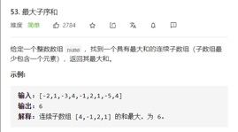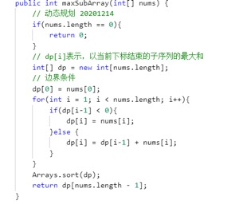

### 3 leetcode062

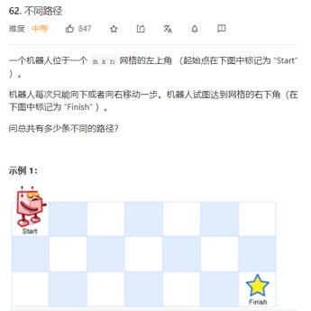

### 4 leetcode063

### 5 leetcode064

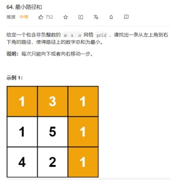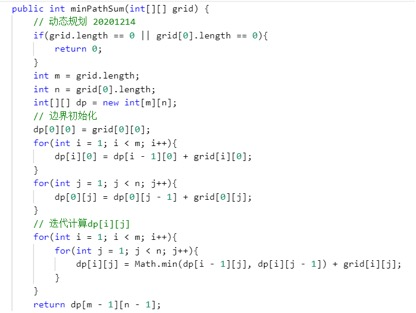

### 6 leetcode070

 ### 7 leetcode072

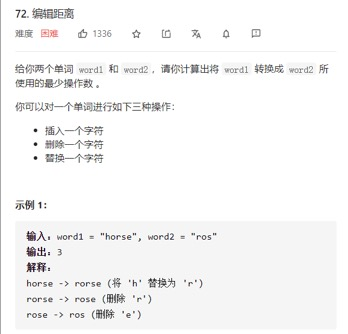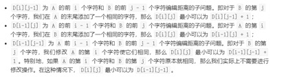

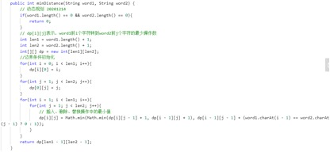

 ### 8 leetcode087（四层dp,有空再看）

 ### 9 leetcode091

注意点：dp[0]的初始化为1。

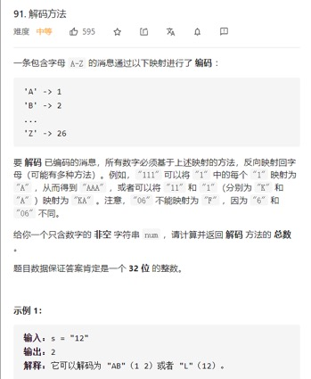

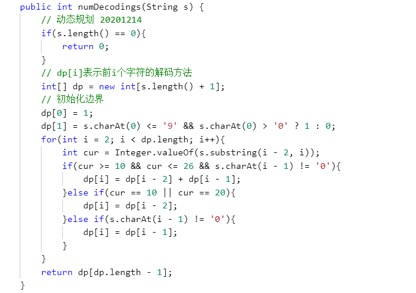

 ### 10 leetcode096

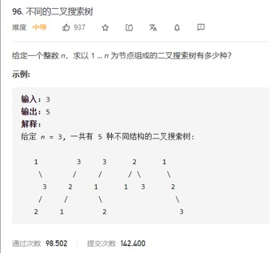

 ### 11 leetcode097

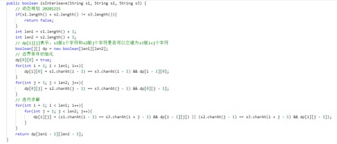

 ### 12 leetcode115

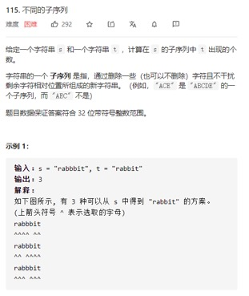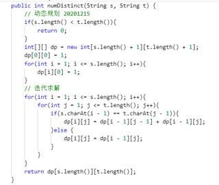

 ### 13 leetcode120

 ### 14 leetcode121

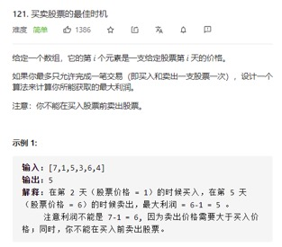

方法一：

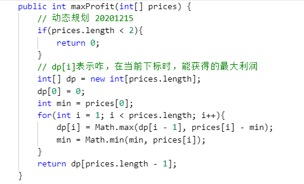

方法二：（这类问题的统一写法）

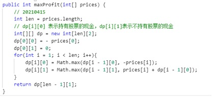

 ### 15 leetcode123

 ### 16 leetcode132

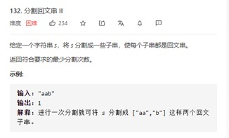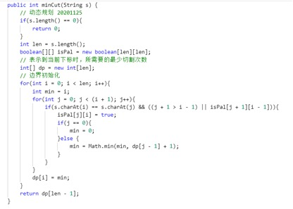

 ### 17 leetcode139

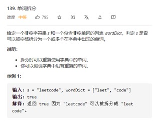

 ### 18 leetcode140

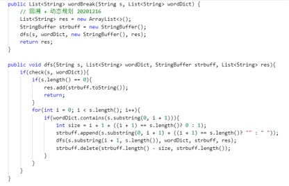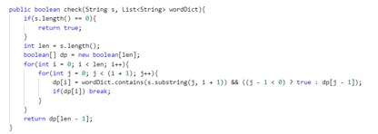

 ### 19 leetcode005

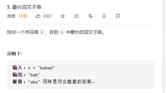

 ### 20 leetcode010

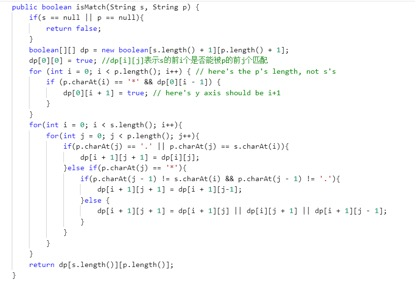

 ### 21 leetcode044

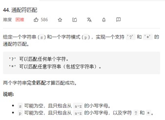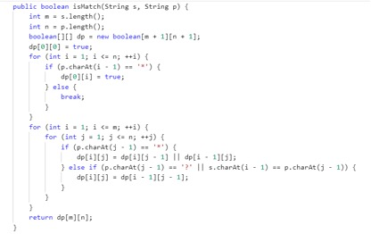

 ### 22 leetcode085

 ### 23 leetcode198

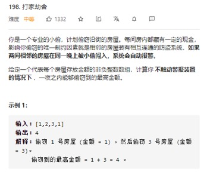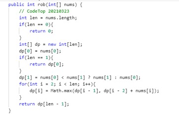

 ### 24 leetcode714

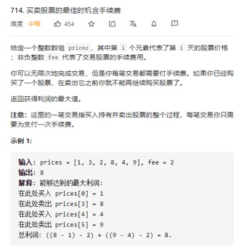

 ### 25 leetcode746

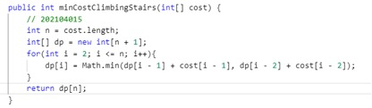

 ### 26 leetcode343

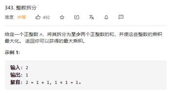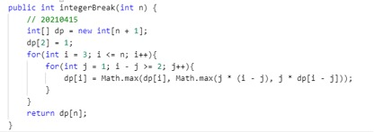

 ### 27leetcode213

 ### 28leetcode337

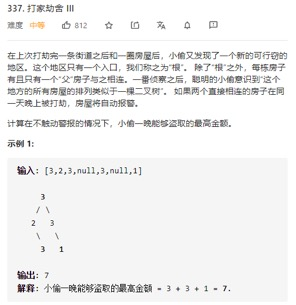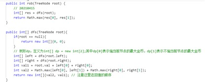

 ### 29leetcode122

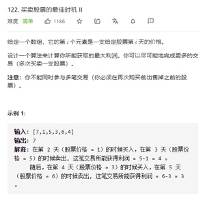

方法一：动态规划

方法二：贪心

 ### 30leetcode188（理解为主）

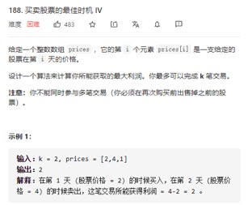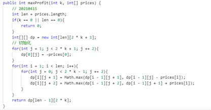

 ### 31leetcode300

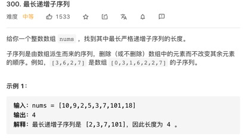 ### 32leetcode674

 ### 33leetcode718

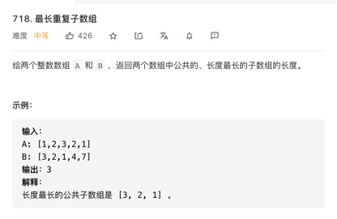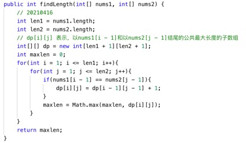

 ### 34leetcode1143

 ### 35leetcode1035

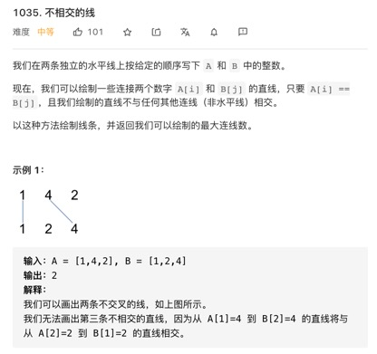

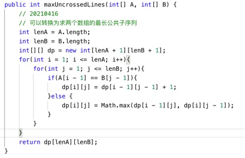

 ### 36leetcode392

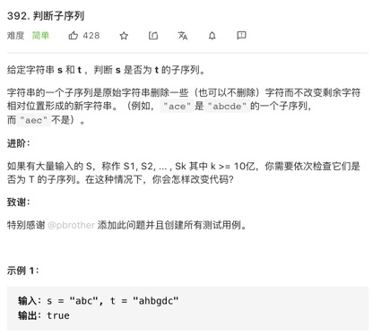

方法一：双指针

方法二：动态规划

 ### 37leetcode583

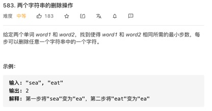

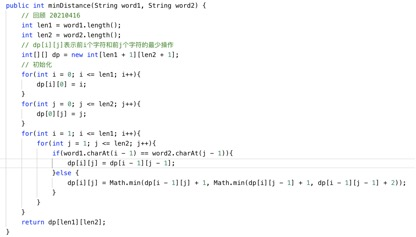

 ### 38leetcode647

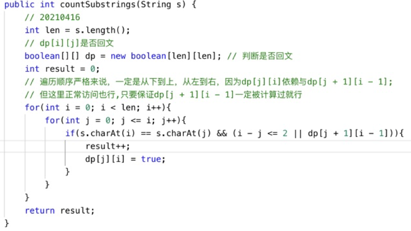

## 二叉树

 ### 1 leetcode105

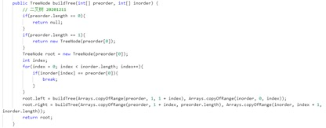

 ### 2 leetcode106

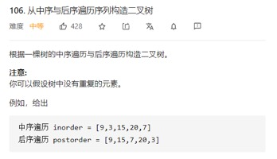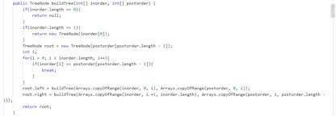

 ### 3 leetcode108

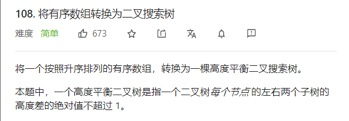

 ### 4 leetcode109

 ### 5 leetcode095

 ### 6 leetcode144

 ### 7 leetcode145

 ### 8 leetcode094

 ### 9 leetcode102

 ### 10 leetcode107

 ### 11 leetcode103

 ### 12 leetcode112

 ### 13 leetcode113

注意点：list添加元素的位置以及判断完成后，不能直接return，因为需要回溯。

 ### 14 leetcode104

 ### 15 leetcode111

 ### 16 leetcode098

第一种：使用pre指针（推荐）

第二种：使用List保存中序遍历结果

 ### 17 leetcode099

 ### 18 leetcode100

 ### 19 leetcode101

 ### 20 leetcode110

 ### 21 leetcode114

 ### 22 leetcode129

 ### 23 leetcode124

 ### 24 leetcode116

 ### 25 leetcode117

 ### 26 leetcode958

 ### 27 leetcode543

 ### 28 leetcode662

注意点：判断最大宽度的代码，需要放在循环的最后一句，保证先更新depth和left。

 ### 29 leetcode863

 ### 30 leetcode226

 ### 31 leetcode559

 ### 32 leetcode257

注意点：在回溯时，注意删掉的字符长度

 ### 33 leetcode404

 ### 34 leetcode513

 ### 35 leetcode654

 ### 36 leetcode617

 ### 37 leetcode700

 ### 38 leetcode530

 ### 39 leetcode501

 ### 40 leetcode235

 ### 41 leetcode701

 ### 42 leetcode669

 ### 43 leetcode230

## 3 链表

 ### 1 leetcode002

 ### 2 leetcode019

 ### 3 leetcode021

 ### 4 leetcode023

 ### 5 leetcode024

 ### 6 leetcode025

 ### 7 leetcode061

 ### 8 leetcode082

注意点：这里的大循环条件是p.next != null

 ### 9 leetcode083

注意点：最后需要cur.next = null 进行排重。

 ### 10 leetcode086

 ### 11 leetcode092

 ### 12 leetcode141

 ### 13 leetcode142

 ### 14 leetcode143

第二种方法：

 ### 15 leetcode147

 ### 16 leetcode148

 ### 17 leetcode234

 ### 18 leetcode160

## 4 回溯法

 ### 1 leetcode017

 ### 2 leetcode022

第一种：回溯

第二种：递归

 ### 3 leetcode039

 ### 4 leetcode040

 ### 5 leetcode046

 ### 6 leetcode047

 ### 7 leetcode051

 ### 8 leetcode052

 ### 9 leetcode077

 ### 10 leetcode078

 ### 11 leetcode079

 ### 12 leetcode090

 ### 13 leetcode093

 ### 14 leetcode131

 ### 15 leetcode037

 ### 16 leetcode126（难搞）

 ### 17 leetcode130

 ### 18 leetcode133

 ### 19 leetcode491

## 5 哈希表

 ### 1 leetcode001

 ### 2 leetcode036

 ### 3 leetcode049

 ### 4 leetcode128

 ### 5 leetcode146

 ### 6 leetcode560

 ### 7 leetcode347

 ### 8 leetcode460
